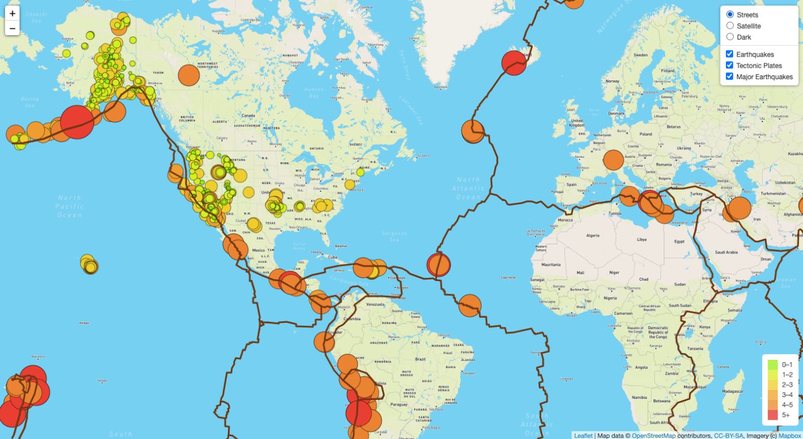
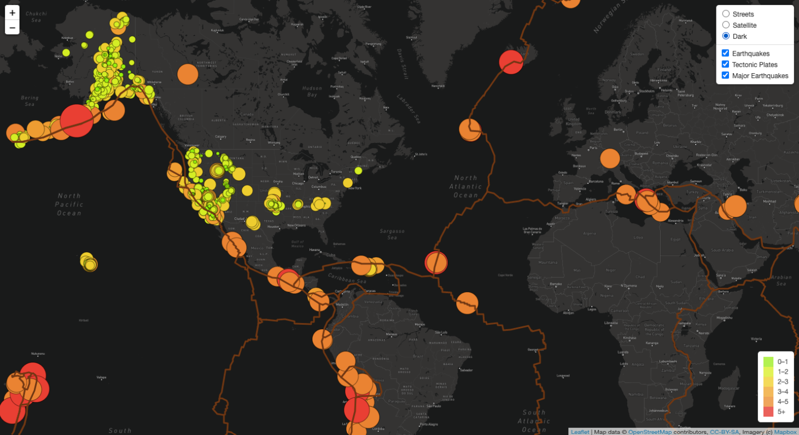
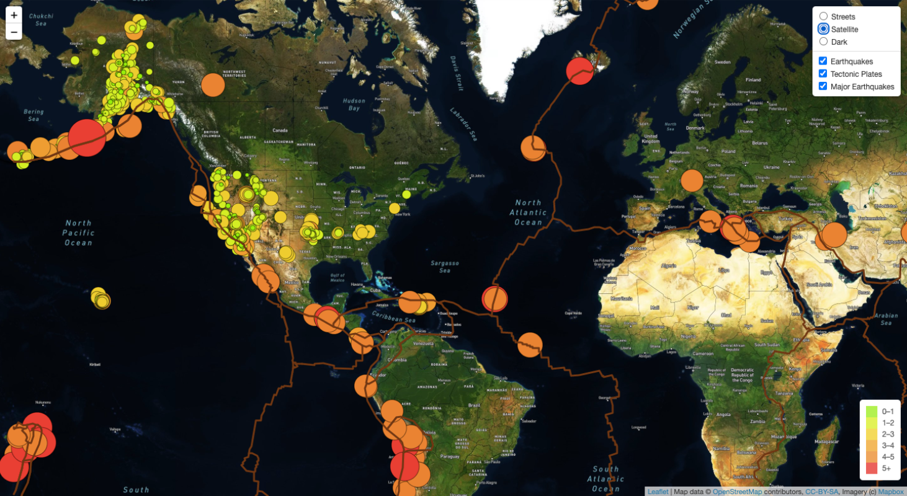

# Mapping_Earthquakes
## Overview
### The purpose of this project is to collect GeoJSON data on earthquakes around the world from the US Geological Survey website. Using a combination of JavaScript, D3.js, and by making API requests to our host server, we are able to collect data and use interactive mapping tiles to make connections on Earthquakes, fault lines, and tectonic plates. Each Earthquake is represented by small or large circles based on the size of the earthquake. The fault lines are represented by the irregular lines across the map. Using your own unique API Key, users will have access to this data that can be deployed on their web browser. 
## Results
### The tools used for this project include Mapbox, D3.js, HTML and CSS, Leaflet, and GeoJSON.
### In order to add different layers to the map, I have uploaded different tiles that can be accessed using my API Key.
### These are the results of the map using street view.

### These are the results of the map using dark view.

### These are the results of the map using satellite view.

